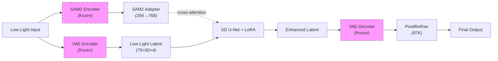

# SAM2-LatentDiff: SAM2-Guided Low-Light Image Enhancement Using Latent Diffusion Models

[](https://www.python.org/downloads/)
[](https://pytorch.org/)
[](LICENSE)

> **SAM2-LatentDiff** enhances low-light images by combining SAM2 hierarchical structural features with a pretrained Stable Diffusion U-Net, fine-tuned via LoRA in latent space. A lightweight PixelRefiner post-processing module addresses VAE reconstruction artifacts.

**Authors:** Anil K Tiwari & Aashish Acharya  
**Affiliation:** CSC 8260 – Georgia State University, Spring 2026  
**Target Paper:** [CUGD (Zeng et al., IEEE TCSVT 2025)](https://ieeexplore.ieee.org/document/11192523)

---

## Highlights

- **Three orthogonal innovations** over the CUGD baseline:
  - Latent-space diffusion (48× spatial reduction via pretrained SD VAE)
  - SAM2 hierarchical encoder features (256-D) replacing binary masks
  - Cross-attention injection with LoRA fine-tuning (0.5% trainable params)
- **Two-stage training**: latent enhancement → pixel refinement
- **87K-parameter PixelRefiner** following DiffBIR/StableSR practice
- **Single forward pass** inference at 111 ms/image on A100

## Results on LOL-v2 Real Test Set

| Method | PSNR ↑ | SSIM ↑ | LPIPS ↓ |
|--------|--------|--------|---------|
| CUGD (baseline, paper) | 21.00 | 0.8300 | 0.2000 |
| **Ours: Latent Only** | 17.19 | 0.5758 | 0.2812 |
| **Ours: + PixelRefiner** | **18.61 ± 3.18** | **0.7085 ± 0.0986** | **0.2399 ± 0.0647** |
| Ablation A: No SAM2 | 18.08 | 0.6731 | 0.3091 |
| Ablation B: Random cond. | 17.87 | 0.6733 | 0.3225 |

## Architecture
### Architecture Overview

### Architecture Overview




## Installation

```bash
git clone https://github.com/YOUR_USERNAME/SAM2-LatentDiff.git
cd SAM2-LatentDiff
pip install -r requirements.txt
```

### Requirements

- Python ≥ 3.10
- PyTorch ≥ 2.3 with CUDA
- NVIDIA GPU with ≥ 16GB VRAM (A100 40GB recommended)
- ~10 GB disk space for checkpoints and data

## Quick Start

### 1. Download Dataset and Checkpoints

```bash
python scripts/download_data.py --output_dir data/
```

### 2. Preprocess (extract SAM2 features + VAE latents)

```bash
python scripts/preprocess.py \
    --data_dir data/LOLv2_Real \
    --output_dir data/preprocessed \
    --sam2_checkpoint checkpoints/sam2/sam2_hiera_large.pt \
    --vae_checkpoint checkpoints/vae
```

### 3. Train Stage 1 (Latent Enhancement)

```bash
python scripts/train_stage1.py \
    --config configs/default.yaml \
    --data_dir data/preprocessed \
    --output_dir checkpoints/stage1
```

### 4. Train Stage 2 (Pixel Refinement)

```bash
python scripts/train_stage2.py \
    --config configs/default.yaml \
    --stage1_checkpoint checkpoints/stage1/best.pt \
    --data_dir data/preprocessed \
    --dataset_dir data/ \
    --output_dir checkpoints/stage2
```

### 5. Evaluate

```bash
python scripts/evaluate.py \
    --config configs/default.yaml \
    --stage1_checkpoint checkpoints/stage1/best.pt \
    --stage2_checkpoint checkpoints/stage2/best.pt \
    --data_dir data/preprocessed \
    --dataset_dir data/ \
    --output_dir outputs/
```

### 6. Run Ablation Studies

```bash
python scripts/run_ablation.py \
    --config configs/default.yaml \
    --stage1_checkpoint checkpoints/stage1/best.pt \
    --stage2_checkpoint checkpoints/stage2/best.pt \
    --data_dir data/preprocessed \
    --dataset_dir data/ \
    --output_dir outputs/ablations/
```

## Google Colab

For users without local GPU access, we provide Colab notebooks:

| Notebook | Description |
|----------|-------------|
| `notebooks/01_Setup_and_Download.ipynb` | Environment setup, dataset download |
| `notebooks/02_Preprocessing.ipynb` | SAM2 feature extraction, VAE encoding |
| `notebooks/03_Train_Stage1.ipynb` | Latent-space LoRA training (80 epochs) |
| `notebooks/04_Train_Stage2.ipynb` | PixelRefiner training (30 epochs) |
| `notebooks/05_Evaluate.ipynb` | Full evaluation + ablation studies |

## Project Structure

```
SAM2-LatentDiff/
├── configs/
│   └── default.yaml              # All hyperparameters
├── src/
│   ├── models/
│   │   ├── sam2_adapter.py       # SAM2 feature projection module
│   │   ├── pixel_refiner.py      # Post-processing CNN
│   │   └── pipeline.py           # Full SAM2-LatentDiff pipeline
│   ├── data/
│   │   └── dataset.py            # LOL-v2 dataset classes
│   ├── losses/
│   │   └── losses.py             # All loss functions
│   └── utils/
│       └── metrics.py            # PSNR, SSIM, LPIPS computation
├── scripts/
│   ├── download_data.py          # Download LOL-v2 + checkpoints
│   ├── preprocess.py             # Extract SAM2 features + VAE latents
│   ├── train_stage1.py           # Stage 1: latent training
│   ├── train_stage2.py           # Stage 2: pixel refinement
│   ├── evaluate.py               # Full evaluation pipeline
│   ├── run_ablation.py           # Ablation A + B
│   └── visualize.py              # Generate figures for paper
├── notebooks/                    # Google Colab notebooks
├── figures/                      # Generated figures
├── requirements.txt
├── LICENSE
└── README.md
```

## Method Details

### Stage 1: Latent-Space Training
- **Backbone:** Stable Diffusion v1.5 U-Net (860M params, frozen)
- **Adaptation:** LoRA r=16, α=16 on all attention + FF layers (~4M trainable)
- **Input:** 8-channel concat [z_low; z_low] + SAM2 cross-attention
- **Output:** Residual correction Δz; enhanced = z_low + Δz
- **Loss:** L1 + 0.5 × L2 in latent space
- **Training:** 80 epochs, batch 8, lr=1e-4, AdamW, cosine annealing, EMA 0.999

### Stage 2: Pixel-Space Refinement
- **Module:** 5-layer CNN, 48 channels, GELU activation (87K params)
- **Input:** 6 channels (decoded + low-light RGB reference)
- **Output:** Residual correction; refined = decoded + refiner(concat)
- **Loss:** Charbonnier + 0.3 × L2 + 0.1 × LPIPS
- **Training:** 30 epochs, batch 4, lr=2e-4, early stopping (patience 7)

## Citation

```bibtex
@misc{tiwari2026sam2latentdiff,
    title={SAM2-Guided Low-Light Image Enhancement Using Latent Diffusion Models},
    author={Tiwari, Anil K and Acharya, Aashish},
    year={2026},
    institution={Georgia State University},
    note={CSC 8260 Final Project}
}
```

## Acknowledgments

- [CUGD](https://github.com/lingyzhu0101/Diffusion_Image_Enhancement) — Target paper
- [Stable Diffusion](https://github.com/CompVis/stable-diffusion) — Pretrained backbone
- [SAM2](https://github.com/facebookresearch/sam2) — Structural feature extractor
- [LoRA / PEFT](https://github.com/huggingface/peft) — Efficient fine-tuning
- [DiffBIR](https://github.com/XPixelGroup/DiffBIR) — Post-processing inspiration

## License

This project is licensed under the MIT License — see [LICENSE](LICENSE) for details.
